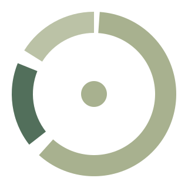

<div align="center">
    
    <h1>
        <b>Simple Time Tracker</b>
    </h1>
    PWA uyumlu, yerel depolama (localStorage) tabanlı, modern, akıcı ve minimalist zaman takip uygulaması.
    <br>
    Tüm veriler tamamen cihazınızda saklanır; sunucu ve telemetri bağlantısı bulunmaz.
</div>

<br>

<div align="center">
    <a href="https://timetracker.sametalkis.me/">
        
    </a>
</div>

<br>

<div align="center">
    <a href="https://timetracker.sametalkis.me/"></a>
    <a href="https://github.com/facebook/react"></a>
    <a href="https://www.typescriptlang.org/"></a>
    <a href="https://vitejs.dev/"></a>
    <a href="https://tailwindcss.com/"></a>
    <a href="https://github.com/pmndrs/zustand"></a>
    <a href="https://recharts.org/"></a>
    <a href="https://framer.com/motion"></a>
    <a href="https://developer.mozilla.org/en-US/docs/Web/Progressive_web_apps"></a>
    <a href="https://workers.cloudflare.com/"></a>
    <a href="LICENSE"></a>
</div>

<br>

## Canlı Uygulama

Uygulamayı tarayıcınız üzerinden doğrudan kullanmak veya mobil/masaüstü cihazınıza PWA olarak yüklemek için:

**[https://timetracker.sametalkis.me/](https://timetracker.sametalkis.me/)**

<br>

## Genel Bakış

**Simple Time Tracker**, günlük aktivitelerinizi ve alışkanlıklarınızı zahmetsizce kaydetmeniz için tasarlanmış modern, minimalist ve gizlilik odaklı (local-first) bir zaman takip uygulamasıdır. 

Zamanı sadece ne kadar harcadığınızla değil, nasıl bir ritim içinde geçirdiğinizle de değerlendirir. Tek dokunuşla sayaç başlatma/durdurma kolaylığının yanı sıra; aktiviteler arası boşlukları tespit etme (**Untracked Time**), birbirini tetikleyen alışkanlık akışlarını analiz etme (**Habit Sequence Flow**), haftalık dağılım ritmini çıkarma ve istikrar serilerini (**Streaks**) takip etme gibi güçlü analitik araçlar sunar.

<br>

## Öne Çıkan Özellikler

- ⚡ **Tek Dokunuşla Hızlı Takip:** Grid üzerindeki aktivite kartına dokunarak sayacı anında başlatın, durdurun veya aktiviteler arasında pürüzsüzce geçiş yapın.
- ⏱️ **Canlı Sayaç & Takip Kartı:** Çalışan seansı saniyesi saniyesine gösteren, süre aşımını fark etmenizi sağlayan dinamik canlı takip paneli.
- 🕒 **Takip Edilmeyen Zaman Tespiti (Untracked Time):** Aktiviteler arasındaki boşlukları otomatik tespit ederek günün 24 saatlik bütünlüğünü sağlar. Boşta geçen süreyi görünür kılar ve tek dokunuşla kayda dönüştürmeye imkan tanır.
- 🧠 **Alışkanlık Zinciri & Akış Analitiği (Habit Sequence Flow):**
  - *"En çok hangi aktiviteden sonra geliyor?"* (Preceding Habits)
  - *"En çok hangi aktiviteye geçiliyor?"* (Succeeding Habits)
  - Seanslar arasındaki geçişleri inceleyerek davranış modellerinizi keşfetmenizi sağlar.
- 📊 **Etkileşimli Donut Grafik & İstatistikler:** Recharts tabanlı halka grafik, dilimler üzerinde aktivite ikonları, yüzde dağılımları ve Gün / Ay / Yıl / Tüm Zamanlar filtreleme seçenekleri.
- 📅 **Haftalık Ritim & Zirve Günler:** Pazartesi'den Pazar'a haftanın günlerine göre süre yoğunluğu ve haftanın en verimli gün göstergesi.
- 🔥 **İstikrar ve Seri Takibi (Streaks):** Aktif gün sayısı, mevcut kesintisiz seri ve rekor gün serisi metrikleri.
- ✏️ **Detaylı Kayıt Yönetimi & Zaman Tüneli:** Gün gün gruplanmış geçmiş seanslar, kayıt birleştirme/bölme (split), başlangıç ve bitiş saatlerini hassas biçimde elle düzenleme.
- 🎨 **Özelleştirilebilir Aktiviteler:** Zengin Lucide ikon kataloğu, renk seçimi ve renk tonuna (hue) göre otomatik estetik sıralama.
- 🖤 **True Black (OLED) & Aydınlık Tema:** Nötr siyah (`#0a0a0a`) OLED dostu karanlık mod ve modern açık tema seçeneği.
- 📲 **PWA & Çevrimdışı Çalışma:** Ağ bağlantısı olmadan da kesintisiz çalışabilen, cihazınıza native uygulama gibi yüklenebilen PWA altyapısı.
- 🔄 **Kapsamlı Çoklu Format İçe / Dışa Aktarma:**
  - **Android STT `.backup`:** Orijinal Android Simple Time Tracker yedek dosyalarını ARGB renk ve ikon eşleştirmeleriyle doğrudan içe aktarma.
  - **CSV Desteği:** `activity name`, `time started`, `time ended` sütunlarına sahip CSV dosyalarını anında tanıma.
  - **JSON Tam Yedek:** Tüm uygulama durumunu tek tıkla dışa aktarma ve geri yükleme.
- 🔒 **%100 Gizlilik & Yerel Depolama:** Tüm veriler yalnızca tarayıcınızın `localStorage` alanında tutulur. Harici sunucuya veri gitmez, üyelik gerekmez, telemetri içermez.

<br>

## Teknoloji Yığını

- **React 19:** Deklaratif kullanıcı arayüzü ve modern fonksiyonel bileşen mimarisi
- **TypeScript 5.x:** Uçtan uca tip güvenliği ve ölçeklenebilir veri modelleri
- **Vite 8:** Son nesil ultra hızlı derleyici ve modüler geliştirme ortamı (HMR)
- **Tailwind CSS 3.4:** True Black (`#0a0a0a`) nötr renk paleti ve responsive tasarım sistemi
- **Zustand 5 (Persist):** Reaktif durum yönetimi ve yerel depolama (`localStorage`) senkronizasyonu
- **Framer Motion 12:** Akıcı sayfa geçişleri, layout animasyonları ve modal etkileşimleri
- **Recharts 3.8:** SVG tabanlı etkileşimli donut ve bar grafikleri, custom label rendering
- **Lucide React:** Minimalist ve tutarlı vektörel ikon seti
- **Vite PWA / Service Worker:** Çevrimdışı önbellekleme ve uygulama kurulum desteği
- **Cloudflare Workers / Pages & Wrangler:** Yüksek hızlı küresel edge SPA dağıtımı

<br>

## Dizin Yapısı

```
.
├── public/                               # PWA manifest, servis işçisi ve statik ikonlar
│   ├── favicon.svg                       # Sekme ikonu
│   ├── icon.svg                          # Vektörel uygulama ikonu (PWA maskable)
│   └── icons.svg                         # Sosyal ve yardımcı ikonlar
├── src/
│   ├── assets/                           # Statik görsel varlıkları
│   ├── components/                       # Yeniden kullanılabilir UI bileşenleri
│   │   ├── ActivityCard.tsx              # Grid üzerindeki tekil aktivite kartı
│   │   ├── ActivityDetailModal.tsx       # Detaylı alışkanlık, seri ve akış analitiği penceresi
│   │   ├── AddActivityModal.tsx          # Aktivite ekleme ve düzenleme modalı
│   │   ├── BottomNav.tsx                 # Alt navigasyon çubuğu (Aktiviteler, Kayıtlar, vb.)
│   │   ├── DateSelectorBar.tsx           # Gün / Hafta / Ay / Yıl zaman aralığı seçici
│   │   ├── DynamicIcon.tsx               # Lucide ikonlarını dinamik render eden bileşen
│   │   ├── EditRecordScreen.tsx          # Kayıt detay düzenleme, bölme ve silme ekranı
│   │   ├── Layout.tsx                    # Ana sayfa düzeni ve responsive kapsayıcı
│   │   ├── RunningTimerCard.tsx          # Canlı akan aktif sayaç kartı
│   │   └── TrackingCard.tsx              # Kayıt listesi ve istatistik aktivite kartı
│   ├── context/                          # React context yapıları
│   │   └── ThemeContext.tsx              # Açık / Koyu tema sağlayıcısı
│   ├── screens/                          # Ana ekran görünümleri
│   │   ├── HomeScreen.tsx                # Aktiviteler ızgarası ve canlı sayaç paneli
│   │   ├── RecordsScreen.tsx             # Zaman çizelgesi ve geçmiş seans kayıtları
│   │   ├── StatisticsScreen.tsx          # Halka grafik ve genel süre analitiği
│   │   └── SettingsScreen.tsx            # Tema, veri yedekleme, içe/dışa aktarım ve sıfırlama
│   ├── store/                            # Durum yönetimi katmanı
│   │   └── useStore.ts                   # Zustand store (CRUD, CSV/Backup/JSON import, LocalStorage)
│   ├── types/                            # TypeScript tip ve arayüz tanımları
│   │   └── index.ts                      # RecordType, Record, RunningRecord, AppState
│   ├── utils/                            # Yardımcı fonksiyonlar ve algoritmalar
│   │   ├── colors.ts                     # Renk tonu sıralama (hue) ve kontrast yardımcıları
│   │   ├── icons.ts                      # Desteklenen ikon kütüphane listesi
│   │   └── time.ts                       # Süre formatlama ve gün bazlı seans bölme mantığı
│   ├── App.css                           # Uygulama genel stil ayarlamaları
│   ├── App.tsx                           # Uygulama kabuğu ve sayfa yönlendirme mantığı
│   ├── index.css                         # Tailwind direktifleri ve CSS değişkenleri
│   └── main.tsx                          # React DOM giriş noktası
├── wrangler.jsonc                        # Cloudflare Workers / Pages SPA yapılandırması
├── vite.config.ts                        # Vite ve VitePWA yapılandırması
├── tailwind.config.js                    # Tailwind CSS ve True Black renk ayarları
├── tsconfig.json                         # TypeScript yapılandırması
├── LICENSE                               # GNU General Public License v3.0
└── package.json                          # Bağımlılıklar ve npm betikleri
```

<br>

## Kurulum ve Yerel Geliştirme

### Gereksinimler
- Node.js (>= 18.0.0)
- npm (>= 9.0.0)

### 1. Depoyu Klonlayın
```bash
git clone https://github.com/sametalkis/Simple-Time-Tracker.git
cd Simple-Time-Tracker
```

### 2. Bağımlılıkları Yükleyin
```bash
npm install
```

### 3. Geliştirme Sunucusunu Başlatın
```bash
npm run dev
```
Uygulama yerel olarak `http://localhost:5173` adresinde çalışacaktır.

### 4. Tip Kontrolü ve Derleme
```bash
# TypeScript tip kontrolü ve üretim derlemesi (dist/)
npm run build

# Üretim derlemesini yerel olarak önizleme
npm run preview

# ESLint kod kalitesi denetimi
npm run lint

# Cloudflare Pages / Workers dağıtımı
npm run deploy
```

<br>

## Veri Modeli ve Gizlilik

Tüm kullanıcı verileri tarayıcının yerel depolama alanında (`localStorage`) `simple-time-tracker` anahtarı altında JSON formatında tutulur:

- `recordTypes`: Tanımlanan aktiviteler (ad, renk, Lucide ikon adı)
- `records`: Tamamlanmış zaman kayıtları (başlangıç, bitiş, toplam saniye)
- `runningRecord`: Varsa şu anda aktif olarak çalışan seans
- `showUntrackedTime`: Takip edilmeyen zaman bloklarının gösterim tercihi

Uygulama harici bir sunucuya veri göndermez, analitik/telemetri içermez ve çerez kullanmaz.

### Örnek JSON Yedek Formatı

```json
{
  "recordTypes": [
    {
      "id": "c7f99b64-1bb6-419b-a01b-c7eb0ff66d01",
      "name": "Yazılım Geliştirme",
      "color": "#3b82f6",
      "icon": "Code"
    },
    {
      "id": "e2d83a12-7bf9-450f-90fa-80ecbf96d5e2",
      "name": "Kitap Okuma",
      "color": "#10b981",
      "icon": "BookOpen"
    }
  ],
  "records": [
    {
      "id": "a9018e7c-882d-4581-ba04-a1317d74cb03",
      "recordTypeId": "c7f99b64-1bb6-419b-a01b-c7eb0ff66d01",
      "startTime": "2026-09-12T09:00:00.000Z",
      "endTime": "2026-09-12T10:45:00.000Z",
      "duration": 6300
    }
  ],
  "runningRecord": null
}
```

<br>

## İlham

Bu proje, Android platformundaki popüler açık kaynaklı [Simple Time Tracker](https://github.com/astubenbord/simple-time-tracker) uygulamasından ilham alınarak modern web ve PWA standartlarıyla sıfırdan geliştirilmiştir.

<br>

## Katkıda Bulunma

1. Depoyu forklayın (`Fork`).
2. Özellik dalı oluşturun (`git checkout -b feature/yeni-ozellik`).
3. Değişikliklerinizi commit edin (`git commit -m 'feat: add new feature'`).
4. Dalınıza push yapın (`git push origin feature/yeni-ozellik`).
5. Bir Pull Request açın.

<br>

## Lisans

Bu proje **GNU General Public License v3.0 (GPL-3.0)** altında lisanslanmıştır. Detaylar için [LICENSE](LICENSE) dosyasına bakınız.
